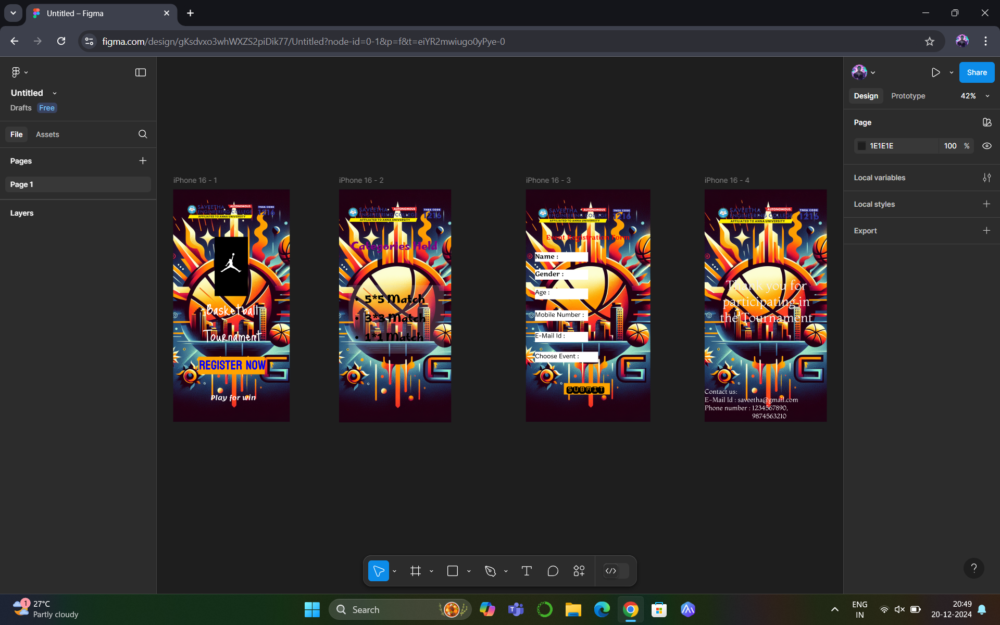

# Ex09 Event Registration Web Application
## Date:20-12-2024

## AIM:
To design, develop and deploy a web application for event registration.

## DESIGN STEPS:

### Step 1:
Create a new frame.

### Step 2:
Select any one preset size of your choice.

### Step 3:
Select the shapes you need.

### Step 4:
Import images as needed.

### Step 5:
Create pages based on your need and link them.

### Step 6:

Validate the HTML and CSS code.

### Step 6:

Publish the website in the given URL.

## DESIGN TOOL:
Figma

## CODE:

```

I page:

<style>
.tournament-container {
  background-color: #fff;
  display: flex;
  max-width: 480px;
  width: 100%;
  flex-direction: column;
  overflow: hidden;
  color: #fff;
  font-weight: 400;
  text-align: center;
  margin: 0 auto;
}

.tournament-wrapper {
  display: flex;
  flex-direction: column;
  position: relative;
  min-height: 852px;
  width: 100%;
  align-items: center;
  padding: 47px 40px 87px;
}

.background-image {
  position: absolute;
  inset: 0;
  height: 100%;
  width: 100%;
  object-fit: cover;
  object-position: center;
}

.header-image {
  aspect-ratio: 5.26;
  object-fit: contain;
  object-position: center;
  width: 100%;
  align-self: stretch;
}

.logo-image {
  aspect-ratio: 0.56;
  object-fit: contain;
  object-position: center;
  width: 122px;
  margin-top: 61px;
  max-width: 100%;
}

.tournament-title {
  position: relative;
  width: 339px;
  font: 64px "Just Me Again Down Here", -apple-system, Roboto, Helvetica, sans-serif;
}

.register-button {
  position: relative;
  z-index: 10;
  background-color: #ffa500;
  margin-top: 81px;
  width: 244px;
  max-width: 100%;
  color: #0000ff;
  padding: 10px 5px;
  font: 48px Koulen, sans-serif;
  cursor: pointer;
  border: none;
  transition: transform 0.2s;
}

.register-button:hover {
  transform: scale(1.05);
}

.register-button:focus {
  outline: 3px solid #fff;
  outline-offset: 2px;
}

.tournament-tagline {
  position: relative;
  margin-top: 62px;
  font: 575 24px Lemonada, sans-serif;
}

.visually-hidden {
  position: absolute;
  width: 1px;
  height: 1px;
  padding: 0;
  margin: -1px;
  overflow: hidden;
  clip: rect(0, 0, 0, 0);
  border: 0;
}
</style>

<div class="tournament-container">
  <div class="tournament-wrapper">
    
    
    
    <h1 class="tournament-title">Basketball Tournament</h1>
    <button class="register-button" tabindex="0">Register Now</button>
    <p class="tournament-tagline">Play for win</p>
  </div>
</div>

```

```
II page:

<style>
  .categories-container {
    background-color: #fff;
    display: flex;
    max-width: 480px;
    width: 100%;
    flex-direction: column;
    overflow: hidden;
    margin: 0 auto;
    font: 600 40px Marhey, sans-serif;
  }

  .categories-wrapper {
    display: flex;
    flex-direction: column;
    position: relative;
    aspect-ratio: 0.481;
    width: 100%;
    padding: 215px 35px;
  }

  .categories-background {
    position: absolute;
    inset: 0;
    height: 100%;
    width: 100%;
    object-fit: cover;
    object-position: center;
  }

  .categories-title {
    position: relative;
    color: #800080;
    text-align: center;
    align-self: center;
  }

  .categories-list {
    position: relative;
    background-color: rgba(217, 217, 217, 0.17);
    color: #000;
    margin: 130px 0 -50px;
    padding: 21px 0 56px;
  }

  .visually-hidden {
    position: absolute;
    width: 1px;
    height: 1px;
    padding: 0;
    margin: -1px;
    overflow: hidden;
    clip: rect(0, 0, 0, 0);
    border: 0;
  }
</style>

<div class="categories-container">
  <div class="categories-wrapper">
    
    <h1 class="categories-title">Categories Held</h1>
    <div class="categories-list" tabindex="0">
      5*5 Match
      <br />
      3*3 Match
      <br />
      1*1 Match
    </div>
  </div>
</div>

```
```
III page:

<style>
  .event-registration-container {
    background-color: #fff;
    display: flex;
    max-width: 480px;
    width: 100%;
    flex-direction: column;
    overflow: hidden;
    color: #000;
    margin: 0 auto;
    font: 400 24px Merge One, sans-serif;
  }
  .registration-wrapper {
    display: flex;
    flex-direction: column;
    position: relative;
    min-height: 852px;
    width: 100%;
    align-items: start;
    padding: 160px 76px 100px 33px;
  }
  .background-image {
    position: absolute;
    inset: 0;
    height: 100%;
    width: 100%;
    object-fit: cover;
    object-position: center;
  }
  .form-title {
    position: relative;
    color: #ff0000;
    font-family: Marko One, sans-serif;
    text-align: center;
    align-self: end;
  }
  .form-field {
    position: relative;
    background-color: #fff;
    width: 195px;
    max-width: 100%;
    padding: 0 0 18px;
    font-family: Marko One, sans-serif;
  }
  .form-field-wide {
    width: 232px;
  }
  .form-spacing {
    margin-top: 43px;
  }
  .form-spacing-sm {
    margin-top: 29px;
  }
  .form-spacing-md {
    margin-top: 32px;
  }
  .form-spacing-lg {
    margin-top: 40px;
  }
  .form-spacing-xl {
    margin-top: 76px;
  }
  .submit-button {
    position: relative;
    background-color: #ffa500;
    align-self: center;
    width: 169px;
    max-width: 100%;
    text-align: center;
    padding: 0 10px 15px;
    font: 40px Monofett, sans-serif;
    border: none;
    cursor: pointer;
  }
  .visually-hidden {
    position: absolute;
    width: 1px;
    height: 1px;
    padding: 0;
    margin: -1px;
    overflow: hidden;
    clip: rect(0, 0, 0, 0);
    border: 0;
  }
</style>

<div class="event-registration-container">
  <div class="registration-wrapper">
    
    <h1 class="form-title">Event Registration Form</h1>
    <form>
      <div class="form-field form-spacing">
        <label for="name">Name:</label>
        <input type="text" id="name" name="name" required aria-label="Enter your name">
      </div>
      
      <div class="form-field form-spacing-sm">
        <label for="gender">Gender:</label>
        <select id="gender" name="gender" required aria-label="Select your gender">
          <option value="">Select gender</option>
          <option value="male">Male</option>
          <option value="female">Female</option>
          <option value="other">Other</option>
        </select>
      </div>

      <div class="form-field form-spacing-md">
        <label for="age">Age:</label>
        <input type="number" id="age" name="age" required min="0" aria-label="Enter your age">
      </div>

      <div class="form-field form-spacing-lg">
        <label for="mobile">Mobile Number:</label>
        <input type="tel" id="mobile" name="mobile" required pattern="[0-9]{10}" aria-label="Enter your mobile number">
      </div>

      <div class="form-field form-spacing-lg">
        <label for="email">E-Mail Id:</label>
        <input type="email" id="email" name="email" required aria-label="Enter your email address">
      </div>

      <div class="form-field form-field-wide form-spacing-lg">
        <label for="event">Choose Event:</label>
        <select id="event" name="event" required aria-label="Select an event">
          <option value="">Select event</option>
          <option value="event1">Event 1</option>
          <option value="event2">Event 2</option>
          <option value="event3">Event 3</option>
        </select>
      </div>

      <button type="submit" class="submit-button form-spacing-xl">Submit</button>
    </form>
  </div>
</div>

```
```

IV page

<style>
.tournament-container {
  background-color: #fff;
  display: flex;
  max-width: 480px;
  width: 100%;
  flex-direction: column;
  overflow: hidden;
  font-family: Montaga, sans-serif;
  font-weight: 400;
  margin: 0 auto;
}

.content-wrapper {
  display: flex;
  flex-direction: column;
  position: relative;
  min-height: 852px;
  width: 100%;
  padding: 321px 52px 19px 0;
}

.background-image {
  position: absolute;
  inset: 0;
  height: 100%;
  width: 100%;
  object-fit: cover;
  object-position: center;
}

.thank-you-heading {
  position: relative;
  color: #f2eeee;
  font-size: 48px;
  text-align: center;
  align-self: end;
}

.contact-info {
  position: relative;
  color: #fff;
  font-size: 24px;
  align-self: start;
  margin-top: 248px;
}

.visually-hidden {
  position: absolute;
  width: 1px;
  height: 1px;
  padding: 0;
  margin: -1px;
  overflow: hidden;
  clip: rect(0, 0, 0, 0);
  border: 0;
}
</style>

<div class="tournament-container">
  <div class="content-wrapper">
    
    <h1 class="thank-you-heading">
      Thank you for participating in the Tournament
    </h1>
    <address class="contact-info">
      Contact us:
      <br />
      E-Mail Id : <a href="mailto:saveetha@gmail.com">saveetha@gmail.com</a>
      <br />
      Phone number : <a href="tel:1234567890">1234567890</a>,
      <br />
      <a href="tel:9874563210">9874563210</a>
      <br />
    </address>
  </div>
</div>

```
## OUTPUT:

 


 

## RESULT:
The program to design, develop and deploy a web application for event registration is completed successfully.
